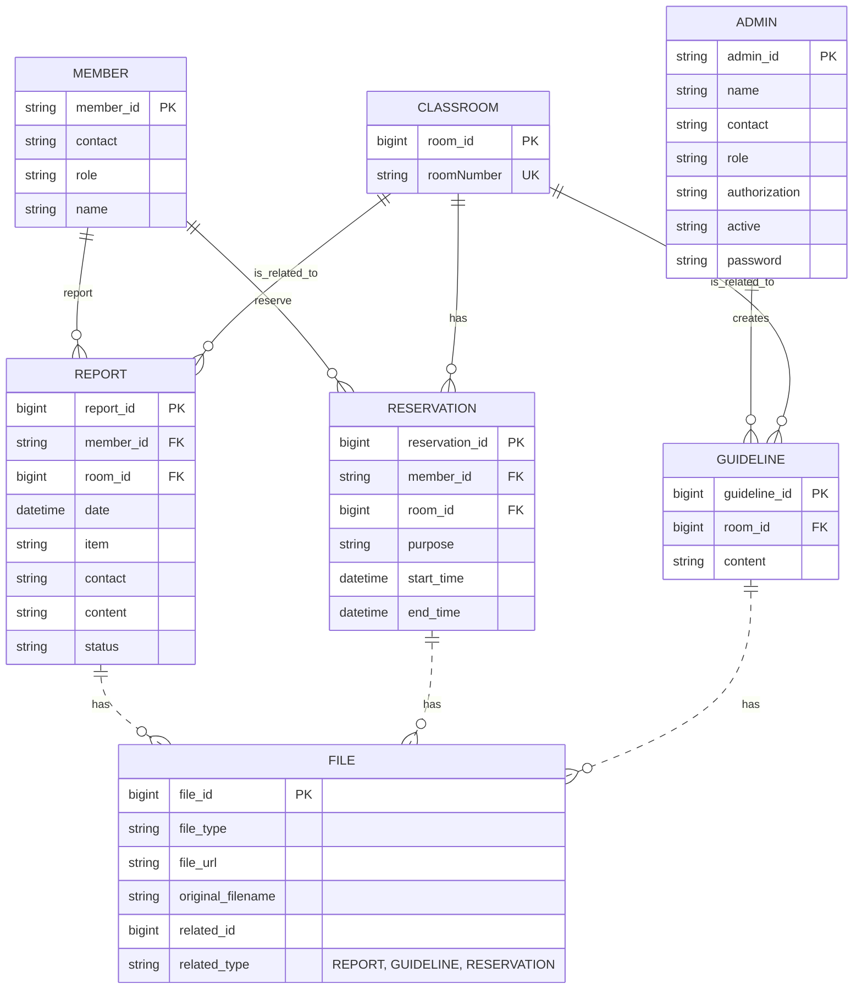
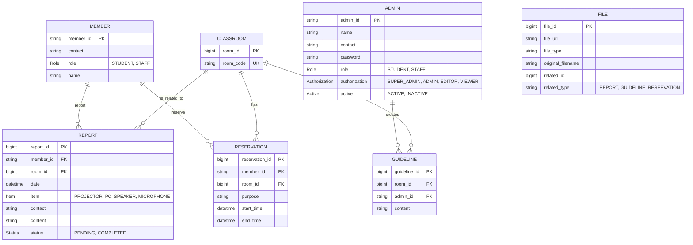

# 강의실 관리 시스템 - Backend

> 우아한테크코스 - 오픈과제 백엔드 API 서버

강의실 예약 및 관리를 위한 RESTful API 서버입니다.

## 📋 목차

- [프로젝트 소개](#-프로젝트-소개)
- [주요 기능](#-주요-기능)
- [기술 스택](#-기술-스택)
- [시작하기](#-시작하기)
- [API 문서](#-api-문서)
- [환경 설정](#-환경-설정)

## 🎯 프로젝트 소개

Spring Boot 기반의 강의실 관리 시스템 백엔드 API 서버입니다.
학생과 교직원의 강의실 예약, 관리자의 가이드라인 관리 기능을 제공합니다.
추가로 고장 신고를 관리합니다.

## ✨ 주요 기능

### 1. 예약 관리
- 강의실 예약 등록
- 예약 조회 (목록/상세)
- 예약 수정 및 취소
- 비밀번호 기반 예약 보호

### 2. 가이드라인 관리
- 강의실별 사용 가이드라인 등록
- 가이드라인 조회
- 파일 첨부 (AWS S3 연동)

### 3. 강의실 관리
- 강의실 목록 조회
- 초기 강의실 데이터 자동 설정

### 4. 인증/인가
- JWT 기반 관리자 인증
- 초기 관리자 계정 자동 생성

### 5. 고장 신고
- 강의실 고장 신고
- 강의실 고장 신고 목록 조회
- 고장 수리 완료 처리

## 🛠 기술 스택

### Backend Framework
- **Spring Boot 3.x** - 애플리케이션 프레임워크
- **Spring Data JPA** - ORM
- **Spring Security** - 인증/인가
- **Spring Web** - RESTful API

### Database
- **MySQL 8.0** - 관계형 데이터베이스
- **Docker Compose** - 컨테이너 오케스트레이션

### Cloud & Storage
- **AWS S3** - 파일 스토리지 (이미지/문서)
- **Spring Cloud AWS** - AWS SDK 통합

### Security
- **JWT (JSON Web Token)** - 토큰 기반 인증
- **BCrypt** - 비밀번호 암호화

### Build Tool
- **Gradle** (추정)

## 🚀 시작하기

### 필수 요구사항
- Java 17+
- Docker & Docker Compose
- AWS 계정 (S3 사용)

### 1. 저장소 클론
```bash
git clone [repository-url]
cd classroom-manager-backend
```

### 2. Docker로 MySQL 실행
```bash
docker-compose up -d
```

### 3. 로컬 설정 파일 생성

**`src/main/resources/application-local.yml` 파일 생성:**
```yaml
# AWS S3 설정
spring:
  cloud:
    aws:
      s3:
        bucket: {bucket 이름}
      credentials:
        access-key: {access key}
        secret-key: {secret-key}

# 관리자 계정
admin:
  super:
    id: super_admin
    password: super_admin

# JWT
jwt:
  secret-key: {secret key}

# Frontend URL
front:
  url: http://localhost:5173
```

⚠️ **보안 주의사항**:
- `application-local.yml` 파일은 절대 Git에 커밋하지 마세요
- `.gitignore`에 추가되어 있는지 확인하세요
- 운영 환경에서는 환경 변수 또는 AWS Secrets Manager 사용 권장

### 4. .gitignore 확인
```gitignore
# 민감한 설정 파일 (반드시 포함!)
application-local.yml
application-dev.yml
application-prod.yml

# 기타
.env
*.log
target/
build/
```

### 5. 애플리케이션 실행
```bash
# Gradle 사용 시
./gradlew bootRun --args='--spring.profiles.active=local'

# Maven 사용 시
./mvnw spring-boot:run -Dspring-boot.run.profiles=local
```

**IntelliJ IDEA에서 실행:**
1. Run → Edit Configurations
2. Active profiles에 `local` 입력
3. Apply → OK
4. 실행 버튼 클릭

서버가 `http://localhost:8080`에서 실행됩니다.

## ⚙️ 환경 설정

### 프로파일 구조
```
src/main/resources/
├── application.yml              # 공통 설정 (Git에 커밋)
├── application-local.yml        # 로컬 개발 (Git 제외)
├── application-dev.yml          # 개발 서버 (Git 제외)
└── application-prod.yml         # 운영 서버 (Git 제외)
```

### application.yml (공통 설정)
```yaml
spring:
  application:
    name: manager
  datasource:
    url: jdbc:mysql://localhost:3306/classroom_db?useSSL=false&allowPublicKeyRetrieval=true
    username: classroom_user
    password: classroom_user
    driver-class-name: com.mysql.cj.jdbc.Driver
  jpa:
    open-in-view: false
    hibernate:
      ddl-auto: create  # 운영: validate
    properties:
      hibernate:
        format_sql: true
    show-sql: true
  cloud:
    aws:
      s3:
        bucket: ${AWS_S3_BUCKET:default-bucket}
      region:
        static: "ap-northeast-2"
      credentials:
        access-key: ${AWS_ACCESS_KEY}
        secret-key: ${AWS_SECRET_KEY}

admin:
  super:
    id: ${ADMIN_ID:super_admin}
    password: ${ADMIN_PASSWORD:super_admin}
    name: "전체 관리자"
    contact: "010-0000-0000"

class:
  code:
    - "5413"
    - "5414"
    - "5527"
    - "5507"
    - "5508"
    - "627-A"
    - "627-B"

jwt:
  access-token-expiration-day: 10
  secret-key: ${JWT_SECRET_KEY}

front:
  url: ${FRONT_URL:http://localhost:5173}
```

### 프로파일별 실행
```bash
# 로컬 개발
./gradlew bootRun --args='--spring.profiles.active=local'

# 개발 서버
./gradlew bootRun --args='--spring.profiles.active=dev'

# 운영 서버
java -jar build/libs/app.jar --spring.profiles.active=prod
```
### 5. 애플리케이션 실행

```bash
# Gradle 사용 시
./gradlew bootRun

# 또는 IDE에서 직접 실행
```

서버가 `http://localhost:8080`에서 실행됩니다.

## 📡 API 문서

### Base URL
```
http://localhost:8080/api
```

### 주요 엔드포인트

#### 예약 관련 API

```http
# 예약 목록 조회
GET /api/reservations/{roomCode}?yearMonth={yearMonth}

# 예약 상세 조회
GET /api/reservations/detail/{reservationId}

# 예약 등록
POST /api/reservations
Content-Type: application/json

{
  "memberId": "2021001",
  "contact": "010-1234-5678",
  "role": "STUDENT",
  "roomCode": "5413",
  "title": "스터디",
  "purpose": "알고리즘 스터디",
  "startDate": "2024-01-15T09:00",
  "endDate": "2024-01-15T11:00",
  "password": "1234"
}

# 예약 수정
PUT /api/reservations/{reservationId}
Content-Type: application/json

{
  "memberId": "2021001",
  "contact": "010-1234-5678",
  "role": "STUDENT",
  "roomCode": "5413",
  "title": "스터디",
  "purpose": "알고리즘 스터디",
  "startDate": "2024-01-15T09:00",
  "endDate": "2024-01-15T11:00",
  "password": "1234"
}

# 예약 취소
DELETE /api/reservations/{reservationId}
Content-Type: application/json

{
    "password":"1234"
}
```

#### 가이드라인 관련 API

```http
# 가이드라인 목록 조회
GET /api/guidelines

# 가이드라인 상세 조회
GET /api/guidelines/{guideLineId}

# 가이드라인 등록 (관리자)
POST /api/guidelines
Authorization: Bearer {jwt-token}
Content-Type: multipart/form-data

{
  "guideLine": {
    "roomCode": "5413",
    "content": "강의실 사용 가이드라인"
  },
  "files": [파일1, 파일2, ...]
}
```

#### 강의실 관련 API

```http
# 강의실 목록 조회
GET /api/classrooms
```

#### 인증 관련 API

```http
# 관리자 로그인
POST /api/admins/login
Content-Type: application/json

{
  "adminId": "super_admin",
  "password": "super_admin"
}

# 응답
{
  "token": "eyJhbGciOiJIUzI1NiIsInR5cCI6IkpXVCJ9...",
}
```

## ⚙️ 환경 설정

### Docker Compose 설정

`docker-compose.yml`:

```yaml
version: '3.8'

services:
  mysql-db:
    image: mysql:8.0
    container_name: classroom-manager-db-container
    restart: always
    environment:
      MYSQL_ROOT_PASSWORD: admin
      MYSQL_DATABASE: "classroom_db"
      MYSQL_USER: "classroom_user"
      MYSQL_PASSWORD: "classroom_user"
    ports:
      - "3306:3306"
    volumes:
      - mysql-data:/var/lib/mysql
    command:
      - --character-set-server=utf8mb4
      - --collation-server=utf8mb4_unicode_ci
      - --default-time-zone=Asia/Seoul

volumes:
  mysql-data:
```

### MySQL 접속 정보

```
Host: localhost
Port: 3306
Database: classroom_db
Username: classroom_user
Password: classroom_user
```

### 초기 데이터

애플리케이션 시작 시 자동으로 생성되는 데이터:

#### 1. 관리자 계정
```
ID: super_admin
Password: super_admin
Role: SUPER_ADMIN
```

#### 2. 강의실 목록
```
- 5413
- 5414
- 5527
- 5507
- 5508
- 627-A
- 627-B
```

## 🗄️ 데이터베이스 스키마
# 개념적 모델링


# 논리적 모델링


## 📦 주요 의존성

```gradle
dependencies {
    // Spring Boot
    implementation 'org.springframework.boot:spring-boot-starter-web'
    implementation 'org.springframework.boot:spring-boot-starter-data-jpa'
    implementation 'org.springframework.boot:spring-boot-starter-security'
    implementation 'org.springframework.boot:spring-boot-starter-validation'
    
    // Database
    runtimeOnly 'com.mysql:mysql-connector-j'
    
    // AWS
    implementation 'org.springframework.cloud:spring-cloud-starter-aws:2.2.6.RELEASE'
    
    // JWT
    implementation 'io.jsonwebtoken:jjwt-api:0.11.5'
    runtimeOnly 'io.jsonwebtoken:jjwt-impl:0.11.5'
    runtimeOnly 'io.jsonwebtoken:jjwt-jackson:0.11.5'
    
    // Test
    testImplementation 'org.springframework.boot:spring-boot-starter-test'
}
```

## 🔧 개발 팁

### MySQL 컨테이너 관리

```bash
# 컨테이너 시작
docker-compose up -d

# 컨테이너 중지
docker-compose down

# 로그 확인
docker-compose logs -f mysql-db

# MySQL 접속
docker exec -it classroom-manager-db-container mysql -u classroom_user -p
```

### 데이터베이스 초기화

```bash
# 컨테이너 및 볼륨 삭제 (데이터 완전 삭제)
docker-compose down -v

# 재시작
docker-compose up -d
```

### JWT 토큰 테스트

```bash
# 로그인
curl -X POST http://localhost:8080/api/admins/login \
  -H "Content-Type: application/json" \
  -d '{"memberId":"super_admin","password":"super_admin"}'

# 응답에서 토큰 복사 후 사용
curl -X GET http://localhost:8080/api/admins/something \
  -H "Authorization: Bearer {your-token}"
```

## 🚨 주의사항

### 보안
- ⚠️ `application.yml`에 있는 AWS 키와 JWT secret은 **절대 Git에 커밋하지 마세요**
- 환경 변수 또는 `.env` 파일 사용 권장
- `.gitignore`에 다음 추가:
  ```
  .env
  application-local.yml
  application-prod.yml
  ```

### DDL 설정
- 개발: `spring.jpa.hibernate.ddl-auto: create`
- 운영: `spring.jpa.hibernate.ddl-auto: validate` 또는 `none`

### CORS 설정
- 프론트엔드 URL을 `front.url`에 정확히 설정
- 운영 환경에서는 도메인 화이트리스트 관리

**Woowa-Tech-Course** - 오픈과제