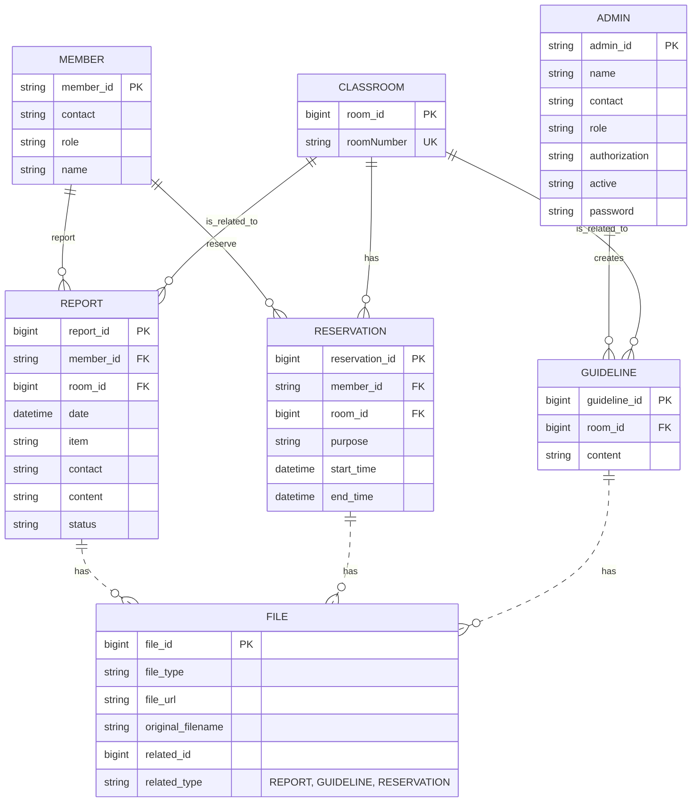
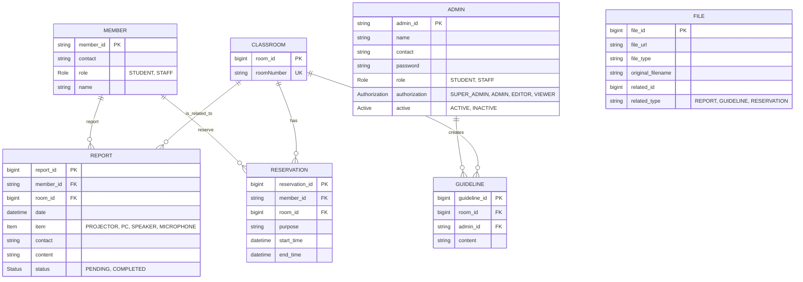

# 개념적 모델링

```mermaid 
erDiagram
    MEMBER {
        string member_id PK
        string contact
        string role
        string name
    }

    ADMIN {
        string admin_id PK
        string name
        string contact
        string role
        string authorization
        string active
        string password
    }

    CLASSROOM {
        bigint room_id PK
        string roomNumber UK
    }

    REPORT {
        bigint report_id PK
        string member_id FK
        bigint room_id FK
        datetime date
        string item
        string contact
        string content
        string status
    }
    
    RESERVATION {
        bigint reservation_id PK
        string member_id FK
        bigint room_id FK
        string purpose
        datetime start_time
        datetime end_time
    }
    
    GUIDELINE {
        bigint guideline_id PK
        bigint room_id FK
        string content
    }
    
    FILE {
        bigint file_id PK
        string file_type
        string file_url
        string original_filename
        bigint related_id
        string related_type "REPORT, GUIDELINE, RESERVATION"
    }
    
    MEMBER ||--o{ REPORT : "report"
    MEMBER ||--o{ RESERVATION : "reserve"
    CLASSROOM ||--o{ RESERVATION : "has"
    CLASSROOM ||--o{ REPORT : "is_related_to"
    ADMIN ||--o{ GUIDELINE :"creates"
    CLASSROOM ||--o{ GUIDELINE : "is_related_to"
    
    REPORT ||..o{ FILE : "has"
    RESERVATION ||..o{ FILE : "has"
    GUIDELINE ||..o{ FILE : "has"
```

# 논리적 모델링

```mermaid
erDiagram
    MEMBER {
        string member_id PK
        string contact
        Role role "STUDENT, STAFF"
        string name
    }

    ADMIN {
        string admin_id PK
        string name
        string contact
        string password
        Role role "STUDENT, STAFF"
        Authorization authorization "SUPER_ADMIN, ADMIN, EDITOR, VIEWER"
        Active active "ACTIVE, INACTIVE"
    }

    CLASSROOM {
        bigint room_id PK
        string roomNumber UK
    }

    REPORT {
        bigint report_id PK
        string member_id FK
        bigint room_id FK
        datetime date
        Item item "PROJECTOR, PC, SPEAKER, MICROPHONE"
        string contact
        string content
        Status status "PENDING, COMPLETED"
    }
    
    RESERVATION {
        bigint reservation_id PK
        string member_id FK
        bigint room_id FK
        string purpose
        datetime start_time
        datetime end_time
    }
    
    GUIDELINE {
        bigint guideline_id PK
        bigint room_id FK
        string admin_id FK
        string content
    }
    
    FILE {
        bigint file_id PK
        string file_url
        string file_type
        string original_filename
        bigint related_id
        string related_type "REPORT, GUIDELINE, RESERVATION"
    }
    
    MEMBER ||--o{ REPORT : "report"
    MEMBER ||--o{ RESERVATION : "reserve"
    CLASSROOM ||--o{ RESERVATION : "has"
    CLASSROOM ||--o{ REPORT : "is_related_to"
    ADMIN ||--o{ GUIDELINE :"creates"
    CLASSROOM ||--o{ GUIDELINE : "is_related_to"
```